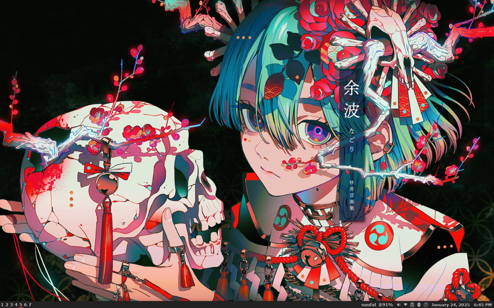

## Desktop Environment

        

- DE : XFCE
- Theme : Matcha-dark-aliz
- Icons : Qogir-ubuntu-dark
- Pointer : Qogir-ubuntu

## Terminal

        

- Terminal Emulator : kitty
- Font : Liberation Mono
- Theme : Mayukai
- Shell : Fish
- Prompt : Starship

### Daily Use CLI Tools

- exa --icons
- bat
- btop
- vim
- ranger
